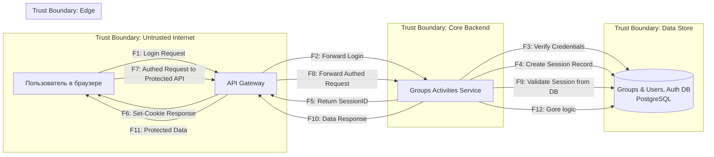

# DFD, SecDev Groups Activities

##  L0

## Легенда к потокам данных

| ID | Источник | Назначение | Ключевые атрибуты | Протокол |
| :--- | :--- | :--- | :--- | :--- |
| **F1** | Пользователь | API Gateway | `(email, password)` | HTTPS/JSON |
| **F2** | API Gateway | Groups Activities Service | `(email, password)` | HTTP |
| **F3** | Groups Activities Service | PostgreSQL DB | `(email, password)` | TCP/SQL |
| **F4** | Groups Activities Service | PostgreSQL DB | `session_id, user_id, expiration_date` | TCP/SQL |
| **F5** | Groups Activities Service | API Gateway | `session_id` | HTTP |
| **F6** | API Gateway | Пользователь | `session_id` | HTTPS |
| **F7** | Пользователь | API Gateway | `Cookie: (session_id)` | HTTPS |
| **F8** | API Gateway | Groups Activities Service | `Cookie: (session_id), request body` | HTTP |
| **F9** | Groups Activities Service | PostgreSQL DB | `session_id, ` | TCP/SQL |
| **F10**| Groups Activities Service | API Gateway | `user_data (email e.t.c )` | HTTP |
| **F11**| API Gateway | Пользователь | `user_data (email e.t.c)` | HTTPS |
| **F12**| Groups Activities Service | PostgreSQL DB | `user_id, group_id` | TCP/SQL |
